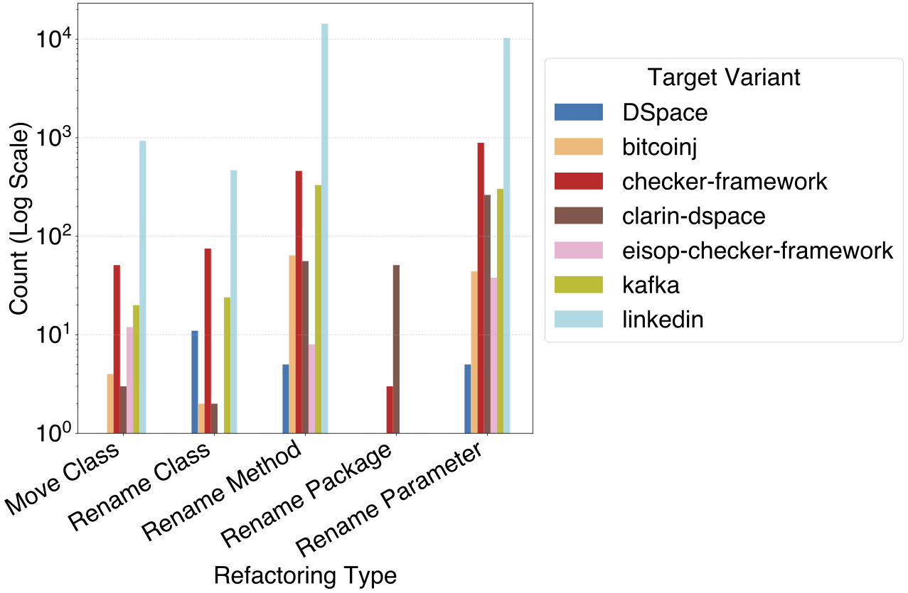

# Refactoring-Aware Patch Integration Across Structurally Divergent Java Forks


[](https://app.fossa.com/projects/custom%2B46484%2Fgithub.com%2Funlv-evol%2FRePatch?ref=badge_shield&issueType=license)
[](https://app.fossa.com/projects/custom%2B46484%2Fgithub.com%2Funlv-evol%2FRePatch?ref=badge_small)
[](https://archive.softwareheritage.org/browse/origin/?origin_url=https://doi.org/10.5281/zenodo.16756017)
[](https://archive.softwareheritage.org/swh:1:dir:fc19605d3ac89e40bf5cac2ac84d07555da246e7;origin=https://doi.org/10.5281/zenodo.16756017;visit=swh:1:snp:fa4e4cd39c8344a1acb683767aff1f562f0572fe;anchor=swh:1:rel:47083a8f3bbc3db63ada27a31acb245972934ddb;path=/unlv-evol-RePatch-f89834b/)
[](https://doi.org/10.5281/zenodo.16756017)


## Overview

This project provides `RePatch` - a tool for refactoring-aware patch integration across structurally divergent Java forks. It automates the process of applying patches from one Java codebase to another, even when the codebases have diverged due to refactorings or structural changes. The tool aims to minimize manual effort and resolve conflicts intelligently, making it easier to maintain and synchronize multiple forks of a Java project.

## How RePatch Works

RePatch is a refactoring-aware patch integration tool designed to transfer bug-fix commits across structurally divergent Java variants. It begins by identifying "Missed Opportunity" patches -- bug fixes present in one variant but absent in its fork using the **PaReco** tool. The system links the source and target repositories, and attempts to apply these patches via `git cherry-pick`.

When standard cherry-pick fails due to refactorings (e.g., method renaming or relocation), RePatch detects and temporarily inverts these structural changes using RefactoringMiner. This alignment enables the patch to be applied successfully. After integration, the original refactorings are replayed to preserve the target’s evolution history. This two-phase process improves patch portability across independently evolving codebases.


> This work is accepted in the research track of The 25th IEEE International Conference on Source Code Analysis and Manipulation ([SCAM 2025](https://conf.researchr.org/home/scam-2025)).
> 
> **Paper: Refactoring-Aware Patch Integration Across Structurally Divergent Java Forks (preprint is available [here](SCAM-2025-Paper-preprint.pdf)**)

## Features

- **Refactoring Detection:** Identifies structural changes between codebases to improve patch application accuracy.
- **Automated Patch Integration:** Applies patches across divergent forks with minimal manual intervention.
- **Conflict Resolution:** Detects and helps resolve integration conflicts.
- **Extensible Architecture:** Modular design for easy extension and customization.

## Project Structure

This section provides an overview of the key components and files in the RePatch repository.

### Project Metadata

These files define the repository's license, usage instructions, and ignore rules:

* `README.md`: Main documentation and overview of the project.
* `LICENSE`, `COPYING`: Licensing details.
* `.gitignore`: Specifies files and folders to exclude from version control.

### Build System

RePatch uses **Gradle** for building and dependency management:

* `build.gradle`: Main Gradle build configuration.
* `settings.gradle`: Project inclusion settings.
* `gradlew`, `gradle/wrapper/*`: Gradle wrapper scripts and binaries.
* `gradle.properties`: Custom build properties.

### CI / GitHub Actions

* `.github/workflows/gradle.yml`: Defines the GitHub Actions pipeline to automatically build and test the project using Gradle.

### Docker Environment

Located in `docker/dev-container-repatch`, this directory contains a ready-to-use Dockerized desktop environment with tools for running and debugging RePatch:

* `Dockerfile`: Builds a full GUI development container with Git, Java, IntelliJ, and RefactoringMiner.
* `docker-compose.yml`: Orchestrates the dev container (and optionally MySQL/phpMyAdmin).
* `Dockerfiles/add_resolution.sh`, `add_resolutions.sh`: Helper scripts for screen resolution setup inside the container.
* `README.md`: Usage instructions for the dev environment.

### Core Integration Logic

The heart of RePatch’s patch integration functionality lives in:

* `IntegrationPipeline.java`: Main entry point that coordinates patch identification and transfer.
* `RePatchIntegration.java`: Contains logic for applying cherry-picked commits, detecting failures, and invoking semantic alignment.

### Data Models

Defines the data structures used during integration, conflict analysis, and result tracking:

* `ComparisonResult.java`, `ConflictBlockData.java`, `ConflictingFileData.java`, `FileDetails.java`, `SourceFile.java`: Represent structured data about file states, conflict regions, and integration metadata.

### Database Layer

Handles persistence of patch analysis and conflict metrics:

* `ConflictBlock.java`, `ConflictingFile.java`, `DatabaseUtils.java`, `FileStatistics.java`, `MergeCommit.java`: Define database entities and helper utilities for storing and querying conflict information.
  
```
RePatch/
├── LICENSE                          # License file (e.g., GPL or similar)
├── COPYING                          # GNU license copy (if applicable)
├── README.md                        # Main project documentation
├── build.gradle                     # Gradle build script
├── settings.gradle                  # Gradle project settings
├── gradle.properties                # Build configuration properties
├── github-autho.properties          # GitHub access credentials (credentials excluded from Git)
├── database.properties              # DB config for persisting conflict metrics
├── .gitignore                       # Git ignore rules
├── .github
│   └── workflows
│       └── gradle.yml                                  # GitHub Actions CI config
├── docker
│   └── dev-container-repatch                           # GUI-based dev environment
│       ├── Dockerfile                                  # Main Docker image build script
│       ├── docker-compose.yml                          # Compose file for webtop + services
│       ├── README.md                                   # Setup instructions
│       └── Dockerfiles
├── gradle/                                             # Gradle wrapper configurations
├── src
│   └── main
│       └── java/edu/unlv/cs/evol
│            └── integration
│                ├── IntegrationPipeline.java           # Main integration logic included
│                ├── RePatchIntegration.java            # Core patch application logic
│                ├── data/
│                    ├── ComparisonResult.java          # Structure for analysis result
│                    │   ├── ConflictBlockData.java     # Structure for conflict block info
│                    │   ├── ConflictingFileData.java   # Structure for file-level conflict info
│                    │   ├── FileDetails.java           # Captures full file metadata
│                    │   └── SourceFile.java            # Represents a source variant file
│                 └── database/
│                    ├── ConflictBlock.java             # Database model for conflict blocks
│                    ├── ConflictingFile.java           # Database model for conflicting files
│                    ├── DatabaseUtils.java             # DB connection helpers
│                    ├── FileStatistics.java            # File-level integration stats
│                    └── MergeCommit.java               # Represents merge commit metadata
│                 └── utils/                            # Helper functions
│            └── repatch
│               ├── matrix/                             # Conflict matrix modeling and resolution
│               ├── refactoringObjects/                 # Data classes representing refactorings
│               ├── replayOperations/                   # Classes to replay transformations
│               ├── invertOperations/                   # Classes to invert transformations
│               └── utils/                              # Git helpers, utility functions
│   │   └── resources/
│   │       ├── META-INF/                               # Plugin configuration
│   │       ├── complete_data/                          # Real-world patch/project integration data
│   │       ├── sample_data/                            # Sample integration scenarios
│   │       ├── repatch_database/                       # Database configuration
│   │       └── create_integration_schema.sql           # SQL setup script
│   └── test/
│       └── resources/
│           ├── extractMethod*                          # Test cases for extract method refactorings
│           ├── moveRename*                             # Test cases for class/method renaming/moving
│           ├── rename*                                 # Method and class rename test data
│           └── rePatchTestData/                        # Refactoring merge replay test cases
```

## Getting Started

### **System Requirements**

To ensure the successful execution and review of the `RePatch` artifact, we recommend the following system configuration:

#### **Hardware**
- **Processor:** 1.18 GHz CPU or faster  
- **RAM:** Minimum of 16 GB  
- **Disk Space:** At least 15 GB of free storage  

#### **Operating System**
- Linux (Ubuntu or Debian-based distribution)  

#### **Software Dependencies**
- Java 11 (OpenJDK)  
- Maven 3.6 or higher  
- Python 3.10 or higher  
- Git (version 2.25 or higher)  
- MySQL Database version 8.0 or higher  
- IntelliJ IDEA 2020.1.2 Community Edition  
- Docker (for optional containerized setup) - Recommended 

#### **Others**
- MySQL Workbench or phpMyAdmin (for GUI-based database interaction)  
- Stable internet connection  

## Installation and Running RePatch

This section will get you through installation and execution of the RePatch tool. **If you want to quickly reproduce the results in the paper without running the tool, kindly refer to "[Reproducing the Results in the Paper](#reproducing-the-results-in-the-paper)" section**.

You can run the **RePatch** tool using one of two approaches:

1. **Locally on your machine**, or
2. **Using Docker**.

The instructions below explain how to run the tool locally. **For most users, we recommend using the containerized setup provided in the [docker](docker/dev-container-repatch/) directory, which includes a dedicated [README](docker/dev-container-repatch/README.md) with step-by-step guidance. This will automatically install and configure all neccessary tools**.


### 1. Clone and build RefactoringMiner 
The lastest version of RefactoringMiner is [here](https://github.com/tsantalis/RefactoringMiner). However, for this project, we used RefactoringMiner 2.2 found [here](https://github.com/manuelohrndorf/com.github.tsantalis.refactoringminer). 
```sh
git clone https://github.com/manuelohrndorf/com.github.tsantalis.refactoringminer
```
Then build RefactoringMiner with `./gradlew distzip`. It will be under build/distributions.

### 2. Add RefactoringMiner to your local maven repository
You will need to add RefactoringMiner to your local maven repository to use it in the build.gradle. You can use `mvn install:install-file -Dfile=<path-to-file>` to add it to your local maven repository. You can verify that it's been installed by checking the path `/home/username/.m2/repository/org/refactoringminer`.

### 3. Build the project
Clone this project (`git clone https://github.com/unlv-evol/Repatch.git`) and open it in IntelliJ IDE. Wait for project to be indexed by IntelliJ. To build the project, click on build tab in the IntelliJ IDE and select `Build Project` to build RePatch.

**Follow the steps below to run the experiment:**

1. Create a GitHub token and add it to `github-oauth.properties`. This is optional if you are running the tool using only the [sample data](src/main/resources/sample_data/) provided.
   
2. Edit the configuration tasks in the IntelliJ IDE under `Run | Edit Configurations` (more information can be found [here](https://www.jetbrains.com/help/idea/run-debug-configuration.html#create-permanent)) to have `:runIde` and include set `-Pmode=` to `integration` and `-PdataPath=` to `repatch-integration-projects`. Then, set `-PevaluationProject=` to the project (target variant) that you want to evaluate on. For our case, it would look like `-PevaluationProject=kafka` since we want to test run integration on `linkedin/kafka`.
```
-Pmode=integration -PdataPath=/repatch-integration-projects -PevaluationProject=linkedin
```

   <p align="center">
      
      <br>
   </p>
**NB: Running the entire experiment takes more than 10 hour to complete. For this reason, we provide one source -> target variant (apache/kakfa -> linkedin/kafka) and 5 bugfix patches (pull requests), alongside the full dataset, to facilitate quick testing of the tool/experiment. Both the test and full projects are located in: `src/main/resources` (sample_data and completed_data) directory**.

3. RePatch will automatically clone the target variant and add the remote source variant. Once this is done, stop the
   running project and open the project being integrated - specified in the `-PevaluationProject`(for our case, it **kafka**) with the IntelliJ IDEA in a new window. This project will be located in the directory specified in the `-PdataPath` -- for our case, it will be located in **/repatch_integration_projects**

4. Wait for IntelliJ to build the cloned project, then close it.

5. Now re-run the `RePatch` by clicking the `Run` button in the IntelliJ IDE.

6. Wait for the integration pipeline to finish processing that project.

The data from the integration pipeline will be stored in the database, `refactoring_aware_integration_repatch`. `RePatch` will create the database if it does not already exist. To access this database, go to you browser on `http://localhost:8080`. This will open phpMyAdmin - **`user`=root** and **`password` = root**. Finally, use the scripts in the [analysis](analysis) directory to get tables and plots from the data.

## Reproducing the Results in the Paper
To repoduce the results in the paper, we provide full database dump found [here](database-dump) to populate the `refactoring_aware_integration` database. Once the database is populated, we provide SQL scripts, `CSV` files and notebook to support reproduciblity of the results reported in the paper. This can be found in the [analysis](analysis) directory and also detailed in each research question below. If you want to regenerate the CSV files, setup and populate the database with the data provide in `database-dump` directory, and run each of the SQL query below. *For easy of use, we recommend using MySQL Workbench or any MySQL DBMS client of your choice*.

#### RQ1: How often do source variant bug-fix patches fail to apply cleanly to target variants using Git’s cherry-pick?
This SQL query provides a summary of merge outcomes for each project fork in the dataset (**See TABLE II in the paper**). It joins the `project` and `patch` tables from the `refactoring_aware_integration` schema to aggregate merge statistics per fork, identified by `fork_name` and `fork_url`. For each fork, it calculates the total number of merge operations (`MO`), and classifies them as either successful (`Passed`) or conflicting (`Failed`) based on the `is_conflicting` flag. The results are ordered in descending order by the number of merge operations, highlighting the most actively evaluated forks.

```sql
SELECT 
    p.fork_name AS Target, p.fork_url AS URL,
    COUNT(pa.id) AS MO,
    SUM(CASE WHEN pa.is_conflicting = 0 THEN 1 ELSE 0 END) AS Passed,
    SUM(CASE WHEN pa.is_conflicting = 1 THEN 1 ELSE 0 END) AS Failed
FROM 
    refactoring_aware_integration.project p
JOIN 
    refactoring_aware_integration.patch pa ON p.id = pa.project_id
GROUP BY 
    p.fork_name, p.fork_url
ORDER BY 
    MO DESC;
```

#### RQ2: What proportion of cherry-pick failures are attributable to refactoring operations (e.g., method / class renaming or moving)?
This SQL query retrieves detailed information about refactoring instances from the `refactoring_aware_integration` schema by linking the `refactoring`, `patch`, and `project` tables. It selects the type of refactoring performed (`refactoring_type`), the associated `project_id` and `patch_id`, and the corresponding project fork name (`fork_name`). By joining the tables through their shared identifiers, the query associates each refactoring instance with its specific project and patch context, providing a foundation for analyzing refactoring activities across different forks. The result can be observed in file: `refactorings_project.csv`

```sql
SELECT refactoring_type, refactoring.project_id, refactoring.patch_id, project.fork_name
FROM refactoring_aware_integration.refactoring, patch, project
WHERE refactoring.patch_id = patch.id AND refactoring.project_id = project.id
```
<p align="center">
  
  <br>
  <em>Figure 3: Top 5 refactoring types associated with cherry-pick failures, grouped by refactoring type (X-axis) and target variant (legend). Y-axis uses a log scale to normalize project size variability and improve comparability across targets.</em>
</p>


#### RQ3: Can a refactoring-aware integration approach reduce merge conflicts and increase the success rate of applying patches across divergent variants?
This SQL query quantifies how the number of conflicting files changes when using RePatch compared to Git-CherryPick for the same merge attempts. It joins the `merge_result` table on `merge_commit_id`, `project_id`, and `patch_id` to pair equivalent merges handled by both tools. It then categorizes each comparison into one of three outcomes: cases where RePatch resulted in fewer conflicting files (`reduced_conflicts`), more conflicting files (`increased_conflicts`), or no change (`unchanged_conflicts`). These aggregated counts provide an overall picture of RePatch’s impact on conflict reduction relative to Git-CherryPick. **See TABLE III in the paper.**

```sql
SELECT
  COUNT(CASE WHEN rep.total_conflicting_files < git.total_conflicting_files THEN 1 END) AS reduced_conflicts,
  COUNT(CASE WHEN rep.total_conflicting_files > git.total_conflicting_files THEN 1 END) AS increased_conflicts,
  COUNT(CASE WHEN rep.total_conflicting_files = git.total_conflicting_files THEN 1 END) AS unchanged_conflicts
FROM merge_result AS git
JOIN merge_result AS rep 
  ON git.merge_commit_id = rep.merge_commit_id
  AND git.project_id = rep.project_id
  AND git.patch_id = rep.patch_id
WHERE git.merge_tool = 'Git-CherryPick'
  AND rep.merge_tool = 'RePatch';
```

This SQL query compares the extent of merge conflicts—measured by the number of conflicting lines of code—between Git-CherryPick and RePatch for identical merge scenarios in the `merge_result` table. By joining on `merge_commit_id`, `project_id`, and `patch_id`, the query ensures a direct comparison of the same merge instance handled by both tools. It then counts how many times RePatch resulted in fewer (`repatch_fewer_conflicting_loc`), more (`repatch_more_conflicting_loc`), or equal (`conflicting_loc_equal`) lines of conflicting code compared to Git-CherryPick. This breakdown helps assess whether RePatch consistently reduces the complexity of merge conflicts at the line-of-code (LOC) level. **See TABLE III in the paper.**

```sql
SELECT
  COUNT(CASE WHEN rep.total_conflicting_loc < git.total_conflicting_loc THEN 1 END) AS repatch_fewer_conflicting_loc,
  COUNT(CASE WHEN rep.total_conflicting_loc > git.total_conflicting_loc THEN 1 END) AS repatch_more_conflicting_loc,
  COUNT(CASE WHEN rep.total_conflicting_loc = git.total_conflicting_loc THEN 1 END) AS conflicting_loc_equal
FROM refactoring_aware_integration.merge_result AS git
JOIN refactoring_aware_integration.merge_result AS rep 
  ON git.merge_commit_id = rep.merge_commit_id
  AND git.project_id = rep.project_id
  AND git.patch_id = rep.patch_id
WHERE git.merge_tool = 'Git-CherryPick'
  AND rep.merge_tool = 'RePatch';
```