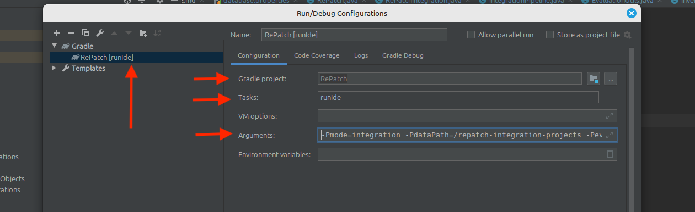

# Development Container for RePatch

This Docker Compose setup starts a Linux container with a full desktop accessible through your web
browser. It runs on any machine with Docker, though a Debian/Ubuntu Linux host is recommended.

All dependencies for building and running RePatch are included in the container: **JDK 17** (which
builds the plugin) alongside **JDK 11** (required for the kafka-era evaluation project SDK),
**IntelliJ IDEA 2024.3.7 Community**, Maven, and a RefactoringMiner 2.1.0 build installed into the
local Maven repository.

> Looking for the headless, CLI-driven evaluation image instead? See
> [containers/README.md](../../containers/README.md). This container is the interactive GUI option.
You must have installed [Docker](https://docs.docker.com/get-started/get-docker/) and [Git](https://git-scm.com/downloads) on your local system.

## Build the Docker Image

First clone the RePatch repository — this gives you the `Dockerfile` and Compose file used below.
RePatch is an extension of RefMerge by [Ellis et al.](https://github.com/ualberta-smr/RefMerge).
```
cd <path to your git folder>
git clone https://github.com/Software-Reengineering/RePatch.git
```

> The image also clones RePatch **inside** itself at build time, and that in-container copy is what
> you actually work on (see [below](#the-project-inside-the-container)). By default it tracks this
> repository's `RePatch-2.0-upgrade` branch; override with
> `docker compose build --build-arg REPATCH_REF=<branch|tag|sha>`.

Assuming Docker is running, initially, build the Docker image with:
```
cd RePatch/docker/dev-container-repatch
docker compose build --no-cache
```

Then start the container with:
```
docker compose up --build
```
In principle, you can install packages (```sudo apt update && sudo apt install -y <packages>```, no sudo password) and make changes within the containerized desktop as on a normal Ubuntu Linux OS.
However, only the user data in ```/config``` (the user's home directory) is mapped to a Docker
volume named ```dev_container_data_repatch``` (see docker-compose.yml). If you delete the container,
only the contents of that volume survive — until you delete the volume too.
 (Checkout the corresponding pages in the Docker Desktop UI or use ```docker ps``` and ```docker volume ls``` to list your containers and volumes.)

## Access the Remote Desktop

### KasmVNC:

After the container has been started, go to ```http://localhost:3000/``` in your browser.
The desktop is only accessible locally.
Note, to use it remotely you would have to remove ```127.0.0.1``` from the docker-compose.yml and consider using a password and HTTPS ```https://localhost:3001/```.
Adjusting the size of the browser window will set the according screen resolution of the desktop.
In the browser window in the left (initially collapsed) side panel, you can also edit settings such as the streaming quality.

#### ```Windows Issue:``` Clock Synchronization

TLDR; If you use *Windows Docker with WSL* make sure your clock is correctly, recently synchronized. 
Otherwise, KasmVNC can cause memory spikes that may crash the desktop session.
Run "synchronize now"  in the settings app (Time and Language > Date and Time) or run```w32tm /resync``` in terminal (administrator).
You can also automate this using the script below.
Lowering the streaming quality (medium streaming setting at FHD 1920 × 1080 pixel, 24 FPS) can also help. 
Alternatively, use RustDesk as described below.

1. Create a new file: C:\Scripts\sync-clock.vbs
   ```
   Set objShell = CreateObject("WScript.Shell")
   objShell.Run "powershell.exe -ExecutionPolicy Bypass -Command ""net start w32time; w32tm /resync""", 0, False
   ```
1. Windows + R: taskschd.msc
1. Create Task... (not Create Basic Task...)
1. General -> Name: Sync-Clock
1. Select Run with highest privileges.
1. Triggers -> New...
   - On workstation unlock
1. Triggers -> New...  
   - On a schedule (One time) -> Advanced settings: Repeat every 1 hour for a duration of Indefinitely
1. Action -> New...
   - Program: wscript.exe
   - Arguments: C:\Scripts\sync-clock.vbs

## Installing and Running RePatch in the Dev-Container
This section will get you through installation and execution of the RePatch tool using docker setup. 

Stopping the container would be comparable to a shut down of the OS.
This is also what Docker does if you shut down your host system or Docker itself; therefore, you may have to start the container after rebooting.
```
docker stop dev-container-repatch
```
Starting the container would be comparable to booting the OS.
```
docker start dev-container-repatch
```

The desktop has a link to start IntelliJ for the project repatch:
- IntelliJ IDEA: RePatch

### The project inside the container

The clone you work on lives in the home directory's git folder:
- ```/config/git/RePatch``` — the copy baked in at image build time

Edits here persist in the `dev_container_data_repatch` volume, but they are **not** connected to the
clone on your host machine; commit and push from inside the container if you want to keep them.


## Build the project
Use the desktop icon to open the project in the IntelliJ IDE. Wait for the project to be indexed by IntelliJ. To build the project, click on build tab in the IntelliJ IDE and select `Build Project`.


**Follow the steps below to run the experiment:**

1. Create a GitHub token and add it to `src/main/resources/github-oauth.properties` (copy
   `github-oauth.properties.template` beside it). This is optional when running with the sample
   data — without a token RePatch connects anonymously, at GitHub's lower rate limit.
   
2. Edit the run configuration in IntelliJ IDEA under `Run | Edit Configurations`
   ([JetBrains guide](https://www.jetbrains.com/help/idea/run-debug-configuration.html#create-permanent))
   to run the `:runIde` task with:
```
-Pmode=integration -PdataPath=repatch-integration-projects -PevaluationProject=kafka
```
   `-PdataPath` is resolved **relative to the home directory**, which is `/config` in this
   container, so the clones land in `/config/repatch-integration-projects`. Add
   `-PdataSet=complete` to run the full paper scenario list instead of the bundled sample.
   <p align="center">
      
      <br>
   </p>

3. RePatch clones the target variant and adds the source variant as a remote. When that finishes,
   stop the run and open the cloned evaluation project (named by `-PevaluationProject`, here
   **kafka**) in a **separate** IntelliJ window. It is under
   **/config/repatch-integration-projects**.

4. Wait for IntelliJ to build the cloned project, then close it.

5. Now re-run the `RePatch` by clicking the `Run` button in the IntelliJ IDE.

6. Wait for the integration pipeline to finish processing that project.

## Results

Data produced by the integration pipeline is stored in the MySQL database `refactoring_aware_integration_repatch`. If it does not already exist, **RePatch** will create it automatically.

To explore the results, open `http://localhost:8080` in your browser. This will open phpMyAdmin - **`user`=root** and **`password` = root**. Inspect the tables—especially `merge_result`, which records how **RePatch** reduced or resolved merge conflicts when `git cherry-pick` failed. The other tables also contain useful metadata and diagnostics such as *refactorings*, *conflicting files*, *conflict blocks*, etc., so give them a look as well.

**If you have any questions or need assistance, please don’t hesitate to contact the TA.**