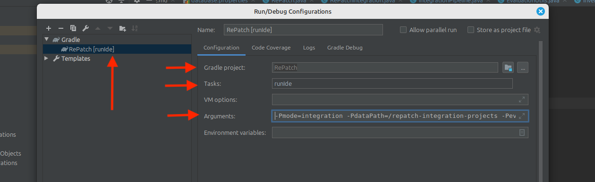

# Development Container for RePatch

This Docker compose starts a Linux container including a desktop accessible through a web browser. While you can run the docker setup in any machine, we still recommended that you use a Linux Os with Debain/Ubuntu distribution.

All dependencies for building and running the repatch tool are included in the container.
You must have installed [Docker](https://docs.docker.com/get-started/get-docker/) and [Git](https://git-scm.com/downloads) on your local system.

## Build the Docker Image

First clone the RePatch repository. RePatch is an extension of RefMerge by [Ellis et al.](https://github.com/ualberta-smr/RefMerge).
```
cd <path to your git folder>
git clone  https://github.com/danielogen/RePatch.git
```

Assuming Docker is running, initially, build the Docker image with:
```
cd RePatch/docker/dev-container-repatch
docker compose build --no-cache
```

Then start the container with:
```
docker compose up --build
```
In principle, you can install packages (```sudo apt update && sudo apt install -y <packages>```, no sudo password) and make changes within the containerized desktop as on a normal Ubuntu Linux OS.
However, only the user data in ```/config``` (the user's home directory) is mapped to a Docker volume ```dev_container_repatch_data``` (see docker-compose.yml), i.e., if you delete the container, only changes wrt. the volume are persistent until you also delete the volume.
 (Checkout the corresponding pages in the Docker Desktop UI or use ```docker ps``` and ```docker volume ls``` to list your containers and volumes.)

## Access the Remote Desktop

### KasmVNC:

After the container has been started, go to ```http://localhost:3000/``` in your browser.
The desktop is only accessible locally.
Note, to use it remotely you would have to remove ```127.0.0.1``` from the docker-compose.yml and consider using a password and HTTPS ```https://localhost:3001/```.
Adjusting the size of the browser window will set the according screen resolution of the desktop.
In the browser window in the left (initially collapsed) side panel, you can also edit settings such as the streaming quality.

#### ```Windowa Issue:``` Clock Synchronization

TLDR; If you use *Windows Docker with WSL* make sure your clock is correctly, recently synchronized. 
Otherwise, KasmVNC can cause memory spikes that may crash the desktop session.
Run "synchronize now"  in the settings app (Time and Language > Date and Time) or run```w32tm /resync``` in terminal (administrator).
You can also automate this using the script below.
Lowering the streaming quality (medium streaming setting at FHD 1920 × 1080 pixel, 24 FPS) can also help. 
Alternatively, use RustDesk as described below.

1. Create a new file: C:\Scripts\sync-clock.vbs
   ```
   Set objShell = CreateObject("WScript.Shell")
   objShell.Run "powershell.exe -ExecutionPolicy Bypass -Command ""net start w32time; w32tm /resync""", 0, False
   ```
1. Windows + R: taskschd.msc
1. Create Task... (not Create Basic Task...)
1. General -> Name: Sync-Clock
1. Select Run with highest privileges.
1. Triggers -> New...
   - On workstation unlock
1. Triggers -> New...  
   - On a schedule (One time) -> Advanced settings: Repeat every 1 hour for a duration of Indefinitely
1. Action -> New...
   - Program: wscript.exe
   - Arguments: C:\Scripts\sync-clock.vbs

## Installing and Running RePatch in the Dev-Container
This section will get you through installation and execution of the RePatch tool using docker setup. **If you want to quickly reproduce the results in the paper without running the tool, kindly refer to "[Reproducing the Results in the Paper](#reproducing-the-results-in-the-paper)" section**. 

Stopping the container would be comparable to a shut down of the OS.
This is also what Docker does if you shut down your host system or Docker itself; therefore, you may have to start the container after rebooting.
```
docker stop dev-container-repatch
```
Starting the container would be comparable to booting the OS.
```
docker start dev-container-repatch
```

The desktop has a link to start IntelliJ for the project repatch:
- IntelliJ IDEA: RePatch

The corresponding project is in the git folder in the home directory: ```/config/git/```
- ```/config/git/RePatch```


## Build the project
Use the desktop icon to open the project in the IntelliJ IDE. Wait for the project to be indexed by IntelliJ. To build the project, click on build tab in the IntelliJ IDE and select `Build Project`.

<!-- #### Edit configuration
Edit the configuration tasks in the IntelliJ IDE under `Run | Edit Configurations` (more information can be found [here](https://www.jetbrains.com/help/idea/run-debug-configuration.html#create-permanent)) to have `:runIde` and include set `-Pmode=` to `integration` and `-PdataPath=` to `repatch-integration-projects`.
Then, set `-PevaluationProject=` to the project (target variant) that you want to evaluate on. For our case,
it would look like `-PevaluationProject=kafka` since we want to test run integration on `linkedin/kafka`.

<p align="center">
  
  <br>
</p> -->


<!-- **NB: Running the entire experiment takes more than 10 hour to complete. For this reason, we provide one source -> target variant (apache/kakfa -> linkedin/kafka) and 5 bugfix patches (pull requests), alongside the full dataset, to facilitate quick testing of the tool/experiment. Both the test and full projects are located in: `src/main/resources` (sample_data and completed_data) directory**.  -->

**Follow the steps below to run the experiment:**

1. Create a GitHub token and add it to `github-oauth.properties`. This is optional if you are running the tool using the test data.
   
2. Edit the configuration tasks in the IntelliJ IDE under `Run | Edit Configurations` (more information can be found [here](https://www.jetbrains.com/help/idea/run-debug-configuration.html#create-permanent)) to have `:runIde` and include set `-Pmode=` to `integration` and `-PdataPath=` to `repatch-integration-projects`. Then, set `-PevaluationProject=` to the project (target variant) that you want to evaluate on. For our case, it would look like `-PevaluationProject=kafka` since we want to test run integration on `linkedin/kafka`.
```
-Pmode=integration -PdataPath=/repatch-integration-projects -PevaluationProject=linkedin
```
   <p align="center">
      
      <br>
   </p>
**NB: Running the entire experiment takes more than 10 hour to complete. For this reason, we provide one source -> target variant (apache/kakfa -> linkedin/kafka) and 5 bugfix patches (pull requests), alongside the full dataset, to facilitate quick testing of the tool/experiment. Both the test and full projects are located in: `src/main/resources` (sample_data and completed_data) directory**.

3. RePatch will automatically clone the target variant and add the remote source variant. Once this is done stop the running project and open the project being integrated - specified in the `-PevaluationProject`(for our case, it **kafka**) with the IntelliJ IDEA in a new window. This project will be located in the directory specified in the `-PdataPath` -- for our case, it will be located in **/config/repatch_integration_projects**

4. Wait for IntelliJ to build the cloned project, then close it.

5. Now re-run the `RePatch` by clicking the `Run` button in the IntelliJ IDE.

6. Wait for the integration pipeline to finish processing that project.

The data from the integration pipeline will be stored in the database, `refactoring_aware_integration_repatch`. `RePatch` will create the database if it does not already exist. To access this database, go to you browser on `http://localhost:8080`. This will open phpMyAdmin - **`user`=root** and **`password` = root**. Finally, use the scripts in the [analysis](analysis) directory to get tables and plots from the data.

## Reproducing the Results in the Paper
To repoduce the results in the paper, we provide full database dump found [here](database-dump) to populate the `refactoring_aware_integration` database. Once the database is populated, we provide SQL scripts, `CSV` files and notebook to support reproduciblity of the results reported in the paper. This can be found in the [analysis](analysis) directory and also detailed in each research question below. If you want to regenerate the CSV files, setup and populate the database with the data provide in `database-dump` directory, and run each of the SQL query below. *For easy of use, we recommend using MySQL Workbench or any MySQL DBMS client of your choice*.

#### RQ1: How often do source variant bug-fix patches fail to apply cleanly to target variants using Git’s cherry-pick?
This SQL query provides a summary of merge outcomes for each project fork in the dataset (**See TABLE II in the paper**). It joins the `project` and `patch` tables from the `refactoring_aware_integration` schema to aggregate merge statistics per fork, identified by `fork_name` and `fork_url`. For each fork, it calculates the total number of merge operations (`MO`), and classifies them as either successful (`Passed`) or conflicting (`Failed`) based on the `is_conflicting` flag. The results are ordered in descending order by the number of merge operations, highlighting the most actively evaluated forks.

```sql
SELECT 
    p.fork_name AS Target, p.fork_url AS URL,
    COUNT(pa.id) AS MO,
    SUM(CASE WHEN pa.is_conflicting = 0 THEN 1 ELSE 0 END) AS Passed,
    SUM(CASE WHEN pa.is_conflicting = 1 THEN 1 ELSE 0 END) AS Failed
FROM 
    refactoring_aware_integration.project p
JOIN 
    refactoring_aware_integration.patch pa ON p.id = pa.project_id
GROUP BY 
    p.fork_name, p.fork_url
ORDER BY 
    MO DESC;
```

#### RQ2: What proportion of cherry-pick failures are attributable to refactoring operations (e.g., method / class renaming or moving)?
This SQL query retrieves detailed information about refactoring instances from the `refactoring_aware_integration` schema by linking the `refactoring`, `patch`, and `project` tables. It selects the type of refactoring performed (`refactoring_type`), the associated `project_id` and `patch_id`, and the corresponding project fork name (`fork_name`). By joining the tables through their shared identifiers, the query associates each refactoring instance with its specific project and patch context, providing a foundation for analyzing refactoring activities across different forks. The result can be observed in file: `refactorings_project.csv`

```sql
SELECT refactoring_type, refactoring.project_id, refactoring.patch_id, project.fork_name
FROM refactoring_aware_integration.refactoring, patch, project
WHERE refactoring.patch_id = patch.id AND refactoring.project_id = project.id
```
<p align="center">
  
  <br>
  <em>Figure 3: Top 5 refactoring types associated with cherry-pick failures, grouped by refactoring type (X-axis) and target variant (legend). Y-axis uses a log scale to normalize project size variability and improve comparability across targets.</em>
</p>


#### RQ3: Can a refactoring-aware integration approach reduce merge conflicts and increase the success rate of applying patches across divergent variants?
This SQL query quantifies how the number of conflicting files changes when using RePatch compared to Git-CherryPick for the same merge attempts. It joins the `merge_result` table on `merge_commit_id`, `project_id`, and `patch_id` to pair equivalent merges handled by both tools. It then categorizes each comparison into one of three outcomes: cases where RePatch resulted in fewer conflicting files (`reduced_conflicts`), more conflicting files (`increased_conflicts`), or no change (`unchanged_conflicts`). These aggregated counts provide an overall picture of RePatch’s impact on conflict reduction relative to Git-CherryPick. **See TABLE III in the paper.**

```sql
SELECT
  COUNT(CASE WHEN rep.total_conflicting_files < git.total_conflicting_files THEN 1 END) AS reduced_conflicts,
  COUNT(CASE WHEN rep.total_conflicting_files > git.total_conflicting_files THEN 1 END) AS increased_conflicts,
  COUNT(CASE WHEN rep.total_conflicting_files = git.total_conflicting_files THEN 1 END) AS unchanged_conflicts
FROM merge_result AS git
JOIN merge_result AS rep 
  ON git.merge_commit_id = rep.merge_commit_id
  AND git.project_id = rep.project_id
  AND git.patch_id = rep.patch_id
WHERE git.merge_tool = 'Git-CherryPick'
  AND rep.merge_tool = 'RePatch';
```

This SQL query compares the extent of merge conflicts—measured by the number of conflicting lines of code—between Git-CherryPick and RePatch for identical merge scenarios in the `merge_result` table. By joining on `merge_commit_id`, `project_id`, and `patch_id`, the query ensures a direct comparison of the same merge instance handled by both tools. It then counts how many times RePatch resulted in fewer (`repatch_fewer_conflicting_loc`), more (`repatch_more_conflicting_loc`), or equal (`conflicting_loc_equal`) lines of conflicting code compared to Git-CherryPick. This breakdown helps assess whether RePatch consistently reduces the complexity of merge conflicts at the line-of-code (LOC) level. **See TABLE III in the paper.**

```sql
SELECT
  COUNT(CASE WHEN rep.total_conflicting_loc < git.total_conflicting_loc THEN 1 END) AS repatch_fewer_conflicting_loc,
  COUNT(CASE WHEN rep.total_conflicting_loc > git.total_conflicting_loc THEN 1 END) AS repatch_more_conflicting_loc,
  COUNT(CASE WHEN rep.total_conflicting_loc = git.total_conflicting_loc THEN 1 END) AS conflicting_loc_equal
FROM refactoring_aware_integration.merge_result AS git
JOIN refactoring_aware_integration.merge_result AS rep 
  ON git.merge_commit_id = rep.merge_commit_id
  AND git.project_id = rep.project_id
  AND git.patch_id = rep.patch_id
WHERE git.merge_tool = 'Git-CherryPick'
  AND rep.merge_tool = 'RePatch';
```